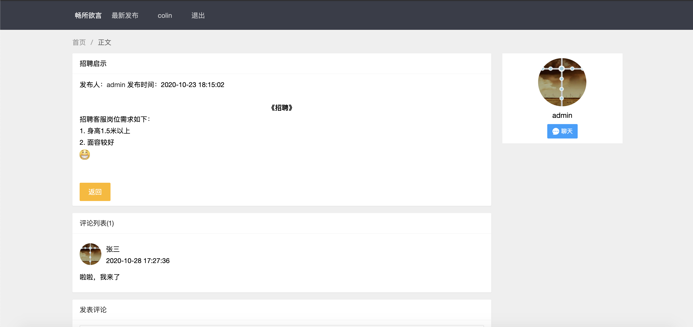
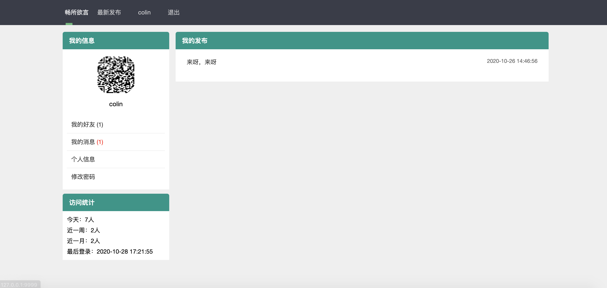
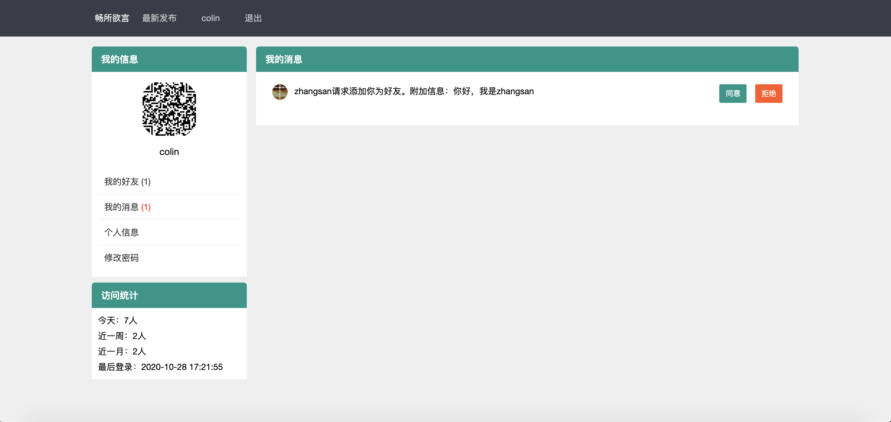
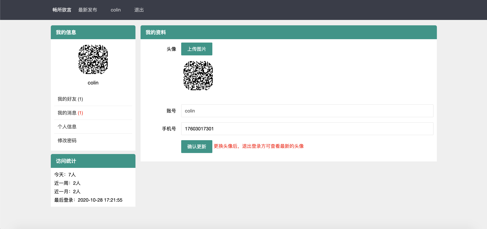

# gobbs
golang的练手留言项目


### 预览






### 安装使用

#### 设置代理和模块

```bash
go env -w GO111MODULE=on
go env -w GOPROXY=https://goproxy.cn
```

#### 运行

```bash
go run main.go
```

#### 安装fresh热刷新

```bin
go get github.com/pilu/fresh
```
#### 使用fresh
在项目目录下执行fresh
```bin
fresh
```

##### -bash: fresh: command not found 解决文案

安装后查看GOPATH位置
```bin
go env | grep 'GOPATH'
```
复制fresh命令到/usr/bin ```[/Users/feiyan/go]```是我的GOPATH路径
```bin
sudo ln -s /Users/feiyan/go/bin/fresh /usr/bin
```
